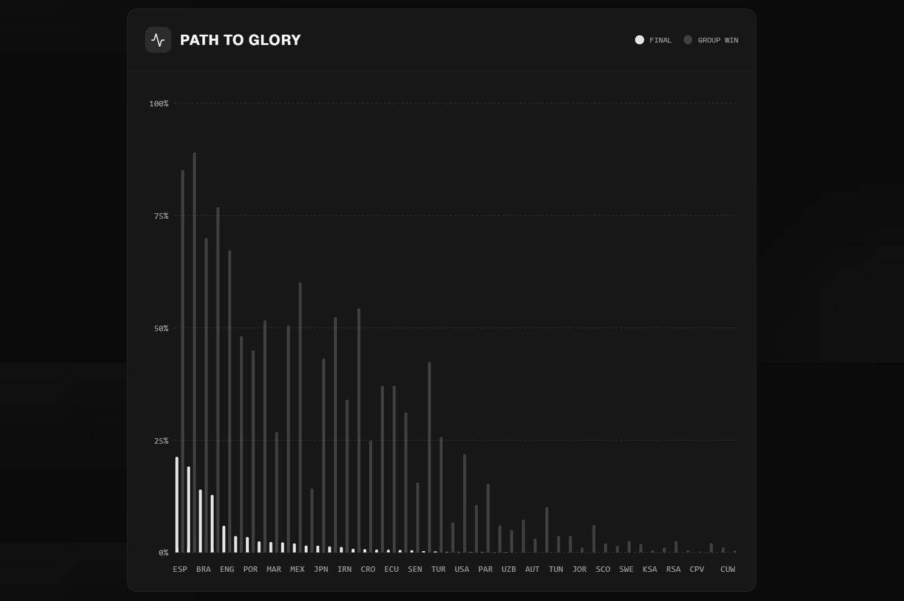
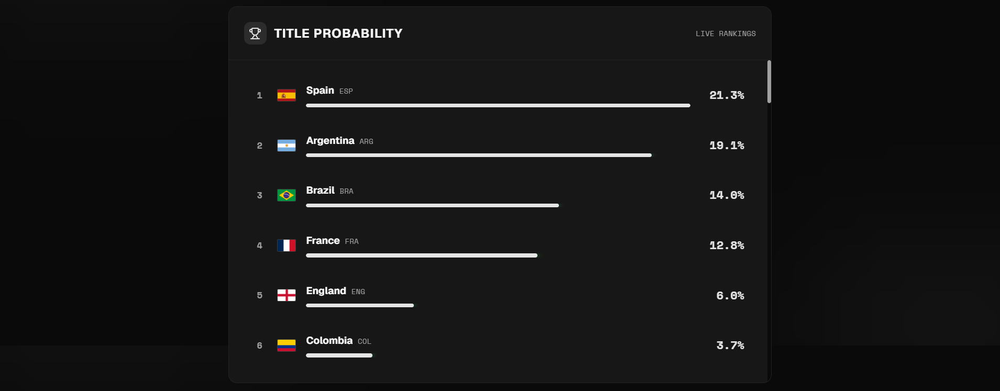
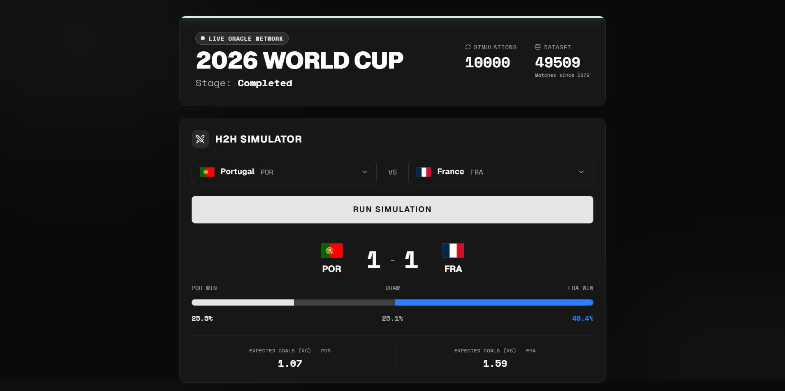
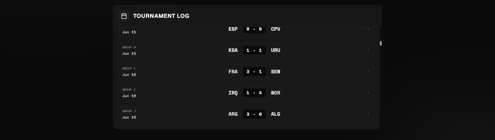
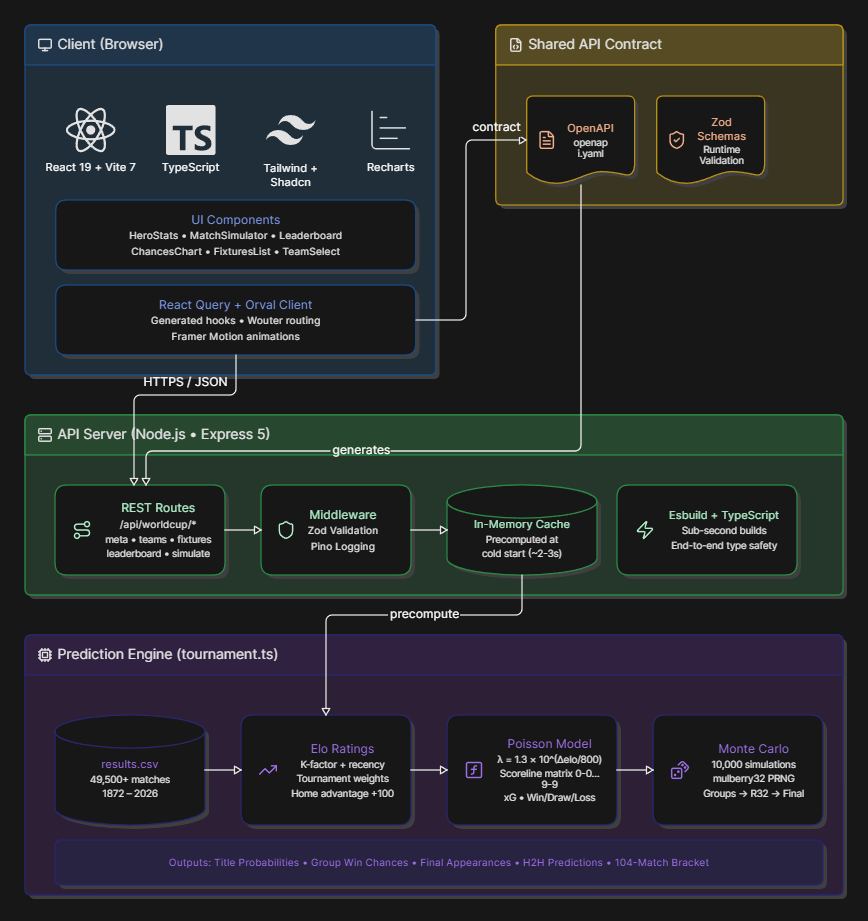

# World Cup Oracle

[](https://react.dev/)
[](https://www.typescriptlang.org/)
[](https://vitejs.dev/)
[](https://tailwindcss.com/)
[](https://expressjs.com/)

A full-stack sports analytics platform for the 2026 FIFA World Cup. Built with historical Elo ratings, a Poisson-based match model, and 10,000-seeded Monte Carlo simulations to predict tournament outcomes, simulate head-to-head matchups, and visualize title probabilities across all 48 qualified nations.



## Features

### Tournament Predictions

- 10,000 seeded Monte Carlo simulations of the complete 2026 bracket: Group Stage, Round of 32, Round of 16, Quarterfinals, Semifinals, and Final
- Title probabilities for every nation, including pre-tournament baselines for comparison
- Group win probabilities across all 12 groups (A-L)
- Final appearance likelihoods and elimination tracking



### Head-to-Head Simulator

- Instant match projections for any two selected teams
- Win/draw/loss probabilities derived from an analytical double-Poisson scoreline matrix (0-0 through 9-9)
- Expected goals (xG) computed from pre-tournament Elo ratings
- Most likely exact scoreline based on Poisson distribution maxima



### Tournament Log

- Complete 104-match bracket with actual scores from the 2026 World Cup
- Chronological ordering from June 11 through July 19, 2026
- Match status indicators and real results for all fixtures including the Final and Third Place Playoff



### Data & Analytics

- Pre-tournament Elo ratings computed from 49,500+ historical international matches spanning 1872-2026
- Time-decay recency weighting and tournament-strength scaling (World Cup: 60, continental championships: 50, qualifiers: 40, friendlies: 20)
- Deterministic mulberry32 PRNG ensuring reproducible results across server restarts

## Tech Stack

### Frontend

- React 19 with concurrent rendering
- TypeScript with strict type safety
- Vite 7 for builds and HMR
- Tailwind CSS 4 with CSS custom properties
- Shadcn/ui component library
- React Query for server state management
- Recharts for data visualization
- Framer Motion for animations
- Wouter for routing

### Backend

- Express 5 REST API with Zod runtime validation
- TypeScript end-to-end via generated schemas
- Pino structured logging with request serialization
- Esbuild for production compilation

### API & Types

- OpenAPI specification as shared contract
- Orval-generated React Query client
- Zod schemas for request/response validation

### Infrastructure

- pnpm workspaces for monorepo management
- GitHub for version control

## Getting Started

### Prerequisites

- Node.js 18+ and pnpm
- Git

### Installation

```bash
git clone https://github.com/aridepai17/worldcuporacle.git
cd worldcuporacle
pnpm install
```

### Development

Two terminals required:

```bash
# Terminal 1: API server (port 3000)
cd artifacts/api-server
pnpm run dev

# Terminal 2: Frontend dev server (port 5173)
cd artifacts/worldcuporacle
pnpm run dev
```

Open http://localhost:5173

### Scripts

```bash
# Workspace
pnpm typecheck   # Type check all packages
pnpm build       # Build all packages

# Frontend
cd artifacts/worldcuporacle
pnpm run dev
pnpm run build
pnpm run typecheck

# Backend
cd artifacts/api-server
pnpm run dev
pnpm run build
pnpm run start
pnpm run typecheck
```

## How It Works

### Elo Rating System

Pre-tournament ratings are computed from the full historical match corpus, restricted to matches before June 11, 2026. The algorithm applies:

- K-factor: 20 * (tournament_weight / 40) * recency_factor * goal_diff_multiplier
- Recency decay: 1.0x for matches within 8 years, 0.85x within 20 years, 0.7x beyond
- Goal difference multiplier: 1.0x for 1-goal margins, 1.5x for 2-goal margins, 1.75x+ for 3+ goal margins
- Home advantage: +100 Elo for non-neutral venues
- Base rating: 1500 for teams without sufficient historical data

### Poisson Match Model

Match outcomes are modeled as independent Poisson distributions for each team's goals:

```
P(A scores a, B scores b) = Poisson(a, lambdaA) * Poisson(b, lambdaB)
```

Expected goals are derived from the Elo rating gap:

```
lambdaA = 1.3 * 10^((eloA - eloB) / 800)
lambdaB = 1.3 * 10^((eloB - eloA) / 800)
```

Both lambdas are clamped to [0.15, 5.0]. The model evaluates all scorelines from 0-0 to 9-9, aggregates win/draw/loss probabilities, and identifies the most likely exact scoreline.

### Monte Carlo Simulation

Title probabilities are generated by simulating the full tournament bracket 10,000 times:

1. Group stage matches are replayed using the Poisson model with seeded randomness
2. Top 2 teams from each group plus the 8 best third-place teams advance
3. Single-elimination knockout rounds proceed through the Round of 32, Round of 16, Quarterfinals, Semifinals, and Final
4. The mulberry32 PRNG is seeded with `RNG_SEED + simulation_index`, making every simulation deterministic and reproducible

### Actual Results

The tournament log is populated with verified 2026 World Cup results:

- 72 group-stage matches
- 16 Round of 32 matches
- 8 Round of 16 matches
- 4 Quarterfinal matches
- 2 Semifinals: France 0-2 Spain, England 1-2 Argentina
- Third Place Playoff: England 6-4 France
- Final: Spain 1-0 Argentina

## Project Structure

```
worldcuporacle/
├── artifacts/
│   ├── api-server/                  # Express backend
│   │   ├── src/
│   │   │   ├── app.ts               # Express app configuration
│   │   │   ├── index.ts             # Server entry point
│   │   │   ├── routes/
│   │   │   │   └── worldcup.ts      # World Cup API endpoints
│   │   │   └── lib/
│   │   │       └── worldcup/
│   │   │           ├── csv.ts       # CSV parser for match data
│   │   │           ├── elo.ts       # Elo rating computation
│   │   │           ├── poisson.ts   # Poisson match model
│   │   │           ├── teamMeta.ts  # 48-team metadata with groups
│   │   │           ├── tournament.ts # Bracket simulation engine
│   │   │           └── cache.ts     # In-memory data cache
│   │   └── data/
│   │       └── results.csv          # 49,500+ historical matches
│   │
│   └── worldcuporacle/              # React frontend
│       ├── src/
│       │   ├── App.tsx              # Root component with routing
│       │   ├── components/
│       │   │   ├── HeroStats.tsx    # Tournament meta dashboard
│       │   │   ├── MatchSimulator.tsx # H2H simulator
│       │   │   ├── Leaderboard.tsx  # Title probability rankings
│       │   │   ├── ChancesChart.tsx # Bar chart visualization
│       │   │   ├── FixturesList.tsx # Tournament log
│       │   │   └── TeamSelect.tsx   # Team selection dropdown
│       │   └── index.css            # Global styles & theme
│       └── package.json
│
├── lib/
│   ├── api-spec/
│   │   ├── openapi.yaml             # API contract
│   │   └── orval.config.ts          # Client generation config
│   ├── api-zod/
│   │   └── src/generated/
│   │       ├── api.ts               # Zod schemas for validation
│   │       └── types/               # TypeScript interfaces
│   └── api-client-react/
│       └── src/generated/
│           ├── api.ts               # React Query hooks
│           └── api.schemas.ts       # TypeScript types
│
└── package.json
```

## Architecture



## API Endpoints

| Endpoint | Method | Description |
|----------|--------|-------------|
| `/api/worldcup/meta` | GET | Tournament metadata (simulations, teams, stage) |
| `/api/worldcup/teams` | GET | All 48 teams with flags, confederations, and Elo |
| `/api/worldcup/leaderboard` | GET | Title probabilities and group win chances |
| `/api/worldcup/fixtures` | GET | Full 104-match tournament bracket with scores |
| `/api/worldcup/simulate-match` | POST | Head-to-head match simulation between two teams |

## Performance

- Cold start: ~2-3 seconds to load CSV, compute Elo, and run 10,000 simulations
- Cached responses: All API responses computed once at startup and served from memory
- Fast builds: Esbuild compiles the backend in under 1 second
- Optimized frontend: Vite HMR with React 19 fast refresh

## Troubleshooting

### Port already in use

```bash
PORT=3001 pnpm run dev  # API server
VITE_PORT=5174 pnpm run dev  # Frontend
```

### CSV data not loading

Ensure `results.csv` exists at `artifacts/api-server/data/results.csv`. The server will fail to start if the file is missing.

### Type errors after pulling

```bash
pnpm install
pnpm typecheck
```

## License

MIT License - see the [LICENSE](LICENSE) file for details.

## Acknowledgments

- Elo rating system based on the work of Arpad Elo
- Poisson distribution model adapted from football analytics literature
- 2026 World Cup data sourced from historical international match databases
- UI components from [Shadcn/ui](https://ui.shadcn.com/)
- Icons from [Lucide](https://lucide.dev/)

## Support

- Issues: https://github.com/aridepai17/worldcuporacle/issues
- Discussions: https://github.com/aridepai17/worldcuporacle/discussions
